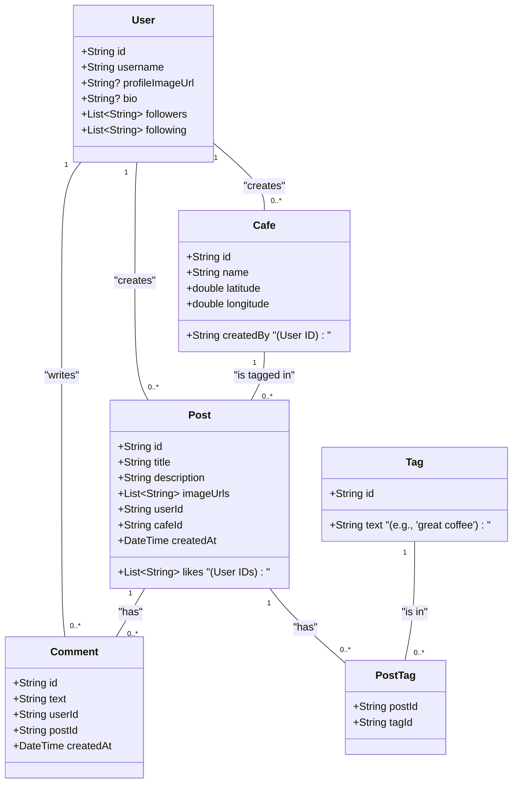

# Beanstalk: Design Document

## 1. Overview

Beanstalk is a mobile social media application for discovering and sharing experiences at cute and interesting cafes. It aims to be a "Strava for cafes," allowing users to create posts about their visits, including photos and descriptions, and tag the specific cafe. The app will feature a public feed, user profiles with follower/following mechanics, likes, comments, and an interactive map to discover new cafes based on user posts.

The application will be built using Flutter, targeting both iOS and Android platforms. The design prioritizes a clean, modern user interface with a bright, coffee-inspired theme, and a robust, scalable architecture to support future growth.

## 2. Detailed Analysis

### 2.1. Problem Statement

Coffee enthusiasts and cafe hoppers currently lack a dedicated platform to discover new spots and share their experiences in a structured, community-driven way. Existing platforms are either too generic (like Instagram) or focused on broad restaurant reviews rather than the niche aesthetic and atmosphere of cafes. Beanstalk will fill this gap by providing a focused, visually-driven experience for this community.

### 2.2. User Stories

*   **As a user, I want to:**
    *   Create an account and a user profile with a username, bio, and profile picture.
    *   See a public feed of recent cafe posts from all users.
    *   Create a new post with a title, a description, and multiple photos.
    *   Tag a cafe in my post by selecting an existing one from a list or creating a new one by pinning its GPS location.
    *   Add descriptive tags to my post (e.g., "great coffee," "cozy atmosphere") to rate my experience.
    *   View all posts associated with a specific cafe.
    *   Like and comment on posts from other users.
    *   View other users' profiles and see their posts.
    *   Follow and unfollow other users.
    *   Use an interactive map to see cafes in my area, represented by clusters of posts.
    *   Tap on a cafe on the map to see its details and related posts.

### 2.3. Functional Requirements

*   **Authentication:** User registration and login.
*   **Feed:** Chronological public feed, paginated for performance.
*   **Post Creation:** Multi-image upload, text fields, and cafe tagging.
*   **Cafe Management:**
    *   Ability to create a new `Cafe` entity with a name and GPS coordinates.
    *   Posts must be linked to a `Cafe`.
*   **Social Features:** Likes, comments, user profiles, follow/unfollow system.
*   **Map:**
    *   Fetch user's current location.
    *   Display cafes/posts on a `google_maps_flutter` widget.
    *   Cluster posts for the same cafe at a single map point.
*   **Theming:** A custom theme with a beige/off-white primary color and brown accents.

### 2.4. Non-Functional Requirements

*   **Performance:** The app must be smooth and responsive, especially when scrolling feeds and interacting with the map.
*   **Scalability:** The architecture must support a growing number of users, posts, and features.
*   **Maintainability:** Code must be well-organized, documented, and easy to modify.
*   **Testability:** The architecture must allow for comprehensive unit and widget testing.

## 3. Alternatives Considered

*   **BLoC for State Management:** The BLoC (Business Logic Component) pattern is a powerful choice for state management, especially in very complex apps. It provides a strict separation of logic and UI. However, for an app of this initial scope, BLoC can introduce significant boilerplate.
*   **Provider for State Management:** Provider is a simple, widely-used state management solution.
*   **Decision:** We will use **MVVM (Model-View-ViewModel)** with `ChangeNotifier`. This pattern offers a great balance of power and simplicity. It clearly separates UI from business logic, is less verbose than BLoC, and is more than capable of handling the state complexities of this application. It aligns well with the principles of Clean Architecture.

## 4. Detailed Design

### 4.1. Architecture: Clean Architecture + MVVM

We will adopt a **Clean Architecture** approach to separate concerns into three distinct layers. This makes the app scalable, testable, and independent of frameworks and UI.

1.  **Data Layer:** Handles all data operations. It will include data sources (network API calls, local database) and repositories that abstract the data sources from the rest of the app.
2.  **Domain Layer:** Contains the core business logic and application-specific rules, encapsulated in "Use Cases" or "Interactors." This layer is pure Dart and has no dependencies on Flutter or any UI components.
3.  **Presentation Layer:** Responsible for the UI. This layer will be built using the **MVVM (Model-View-ViewModel)** pattern.
    *   **View:** The Flutter widgets that make up the UI. They are "dumb" and only react to state changes from the ViewModel.
    *   **ViewModel:** The "brain" of the View. It holds the UI state, executes business logic (by calling use cases from the Domain layer), and notifies the View of any changes using `ChangeNotifier`.

```mermaid
graph TD
    subgraph Presentation Layer
        A[View (Widgets)] -->|User Actions| B(ViewModel);
        B -->|State Changes| A;
    end

    subgraph Domain Layer
        C[Use Cases (Business Logic)];
    end

    subgraph Data Layer
        D[Repositories];
        E[Data Sources (API, DB)];
    end

    B -->|Calls| C;
    C -->|Accesses Data Via| D;
    D -->|Fetches/Pushes Data| E;
```

### 4.2. Directory Structure (Feature-First)

The project will be organized by feature to promote modularity and ease of navigation.

```
lib/
|
├───src/
│   │
│   ├───core/                    # Shared utilities, constants, theme, base classes
│   │   ├───api/                 # API client configuration (e.g., Dio setup)
│   │   ├───theme/               # AppTheme class
│   │   └───utils/               # Utility functions
│   │
│   ├───data/                    # Data Layer
│   │   ├───datasources/         # Remote and local data sources
│   │   ├───models/              # Data models (User, Post, Cafe, etc.) with fromJson/toJson
│   │   └───repositories/        # Repository implementations
│   │
│   ├───domain/                  # Domain Layer
│   │   ├───entities/            # Business objects (optional, can use models directly)
│   │   ├───repositories/        # Abstract repository interfaces
│   │   └───usecases/            # Use cases for each feature
│   │
│   └───presentation/            # Presentation Layer (Features)
│       │
│       ├───auth/                # Login, Register
│       │   ├───view/
│       │   └───viewmodel/
│       │
│       ├───feed/                # Main public feed
│       │   ├───view/
│       │   └───viewmodel/
│       │
│       ├───post/                # Post creation, post details, comments
│       │   ├───view/
│       │   └───viewmodel/
│       │
│       ├───map/                 # Map view for discovering cafes
│       │   ├───view/
│       │   └───viewmodel/
│       │
│       └───profile/             # User profiles
│           ├───view/
│           └───viewmodel/
│
├───main.dart                    # App entry point
└───app.dart                     # MaterialApp setup, router config
```

### 4.3. Data Models

We will use `json_serializable` for robust JSON parsing.



### 4.4. State Management

Each feature's ViewModel will extend `ChangeNotifier`. Widgets will use `ChangeNotifierProvider` (from the `provider` package) to access ViewModels and `Consumer` or `context.watch` to rebuild when the state changes.

### 4.5. Navigation

We will use the `go_router` package for declarative, URL-based navigation. This simplifies deep linking and routing logic.

**Key Routes:**
*   `/` (Feed)
*   `/map` (Map View)
*   `/post/new` (Create Post)
*   `/post/:id` (Post Details)
*   `/post/:id/comments` (Comments)
*   `/profile/:userId` (User Profile)
*   `/cafe/:id` (Cafe Details)
*   `/login`

### 4.6. API Design (RESTful)

*   `GET /feed` - Get public feed (paginated)
*   `POST /posts` - Create a new post
*   `GET /posts/{id}` - Get post details
*   `POST /posts/{id}/like` - Like a post
*   `DELETE /posts/{id}/like` - Unlike a post
*   `GET /posts/{id}/comments` - Get comments for a post
*   `POST /posts/{id}/comments` - Add a comment
*   `POST /cafes` - Create a new cafe
*   `GET /cafes/{id}` - Get cafe details
*   `GET /users/{id}` - Get user profile
*   `POST /users/{id}/follow` - Follow a user
*   `DELETE /users/{id}/follow` - Unfollow a user

### 4.7. Key Packages & Tools

*   **State Management:** `provider`
*   **Navigation:** `go_router`
*   **Networking:** `dio` (for advanced features like interceptors) or `http`
*   **JSON:** `json_serializable`, `json_annotation`
*   **Maps:** `google_maps_flutter`
*   **Location:** `geolocator`
*   **Image Handling:** `image_picker` (picking), `cached_network_image` (caching/display)
*   **Formatting:** `dart_format`
*   **Linting:** `flutter_lints`

## 5. Summary of Design

The Beanstalk app will be built on a foundation of **Clean Architecture** with a **Feature-First** project structure and the **MVVM** pattern in the presentation layer. This robust design ensures a clear separation of concerns, making the application scalable, testable, and maintainable. It leverages modern, community-recommended packages for core functionalities like navigation (`go_router`), location (`geolocator`), and state management (`provider`), providing a solid and efficient development path.

## 6. References

*   **Flutter Architecture:**
    *   [https://flutter.dev/docs/development/data-and-backend/state-mgmt/options](https://flutter.dev/docs/development/data-and-backend/state-mgmt/options)
    *   [https://medium.com/flutter-community/flutter-clean-architecture-a-true-love-story-336292674364](https://medium.com/flutter-community/flutter-clean-architecture-a-true-love-story-336292674364)
*   **Location and Maps:**
    *   [https://pub.dev/packages/google_maps_flutter](https://pub.dev/packages/google_maps_flutter)
    *   [https://pub.dev/packages/geolocator](https://pub.dev/packages/geolocator)
*   **Image Handling:**
    *   [https://pub.dev/packages/image_picker](https://pub.dev/packages/image_picker)
    *   [https://pub.dev/packages/cached_network_image](https://pub.dev/packages/cached_network_image)
*   **Navigation:**
    *   [https://pub.dev/packages/go_router](https://pub.dev/packages/go_router)
